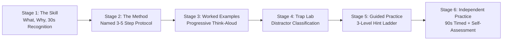

# SAT Reading Skills Academy 🏛️
### *Master the Metacognition Behind Digital SAT Reading*

A dependency-free, offline-first strategy-instruction web application engineered to teach B1–B2 ESL learners and SAT test-takers the expert thinking processes behind every Digital SAT Reading question type.

---

## 📚 Pedagogical Architecture

Rather than merely presenting quizzes, **SAT Reading Skills Academy** uses a 6-stage gradual release framework (*I Do → We Do → You Do*) to make invisible reading strategies visible:



### 1. Stage 1 — The Skill ("What & Why")
- Plain-English definitions of what the question type tests.
- Exam frequency and timing weighting.
- **The 30-Second Recognition Test**: Stems and structural triggers used by the College Board.

### 2. Stage 2 — The Method ("The Steps")
- A named 3–5 step cognitive protocol per question type (e.g., *The BLANK Method*, *The Must-Be-True Rule*).
- "Top 1% Reader Move" callouts explaining how expert readers process the text.
- Accessible at any time during practice as a persistent reference card (<kbd>M</kbd> shortcut).

### 3. Stage 3 — Worked Examples ("Watch Me Think")
- 2 authentic SAT passages per module.
- Progressive-reveal think-aloud timeline (<kbd>Enter</kbd> to step through expert reasoning).
- Distractor trap classification annotated for every wrong choice.
- ESL interactive glosses on SAT-tier academic vocabulary.

### 4. Stage 4 — Trap Lab ("Know the Enemy")
- Interactive drills training students to identify the College Board's distractor taxonomy:
  - ⚠️ **Too Extreme**: Words like *all*, *never*, *strictly*, *proves*.
  - 🌓 **Half Right**: True facts answering the wrong question or describing minor details.
  - 🔄 **Opposite**: Reverses the author's stance or swaps cause and effect.
  - 🛸 **Out of Scope**: Plausible external claims with zero textual backing.
  - 📖 **Wrong Meaning**: Primary dictionary definitions that fail in context.
  - 📊 **Misused Evidence**: Accurate numbers linked to an invalid conclusion.

### 5. Stage 5 — Guided Practice ("We Do")
- 4 items per module equipped with a 3-tier hint ladder:
  - **Level 1 (Nudge)**: Directs attention to the pivot sentence.
  - **Level 2 (Strategy Reminder)**: Reminds the student of the specific method step.
  - **Level 3 (Partial Elimination)**: Narrows the choices to two with reasoning.
- Tracks hint usage: ≤1.0 average hints required for mastery.

### 6. Stage 6 — Independent Practice ("You Do")
- 4 items per module with an optional 90-second exam countdown timer.
- Detailed post-submission explanations and distractor trap breakdowns.
- End-of-module 3-part Self-Assessment Rubric stored alongside performance metrics.

---

## 🗺️ Curriculum Scope: 7 Complete Modules

| Module ID | Domain | Module Title | Named Method | Worked / Guided / Independent Items |
|---|---|---|---|---|
| `MOD-0` | **Foundations** | Reading Like the SAT Wants | *The ACTIVE Framework* | 2 Worked / 4 Guided / 4 Independent |
| `MOD-1` | **Craft & Structure** | Words in Context | *The BLANK Method* | 2 Worked / 4 Guided / 4 Independent |
| `MOD-2` | **Craft & Structure** | Text Structure & Purpose | *The Blueprint Technique* | 2 Worked / 4 Guided / 4 Independent |
| `MOD-3` | **Craft & Structure** | Cross-Text Connections | *The Venn Bridge Protocol* | 2 Worked / 4 Guided / 4 Independent |
| `MOD-4` | **Information & Ideas** | Central Ideas & Details | *The Umbrella Test* | 2 Worked / 4 Guided / 4 Independent |
| `MOD-5` | **Information & Ideas** | Command of Evidence (Text & Data) | *The Anchor-Match Protocol* | 2 Worked / 4 Guided / 4 Independent |
| `MOD-6` | **Information & Ideas** | Inferences | *The Must-Be-True Rule* | 2 Worked / 4 Guided / 4 Independent |

---

## 🚀 Getting Started & Offline Usage

This application is **100% dependency-free** and requires zero installation, build tools, or network connections:

1. Double-click `sat-reading-academy/index.html` to open directly in any modern browser (`Chrome`, `Edge`, `Firefox`, `Safari`).
2. Alternatively, run a local web server:
   ```bash
   npx serve sat-reading-academy
   # or
   python -m http.server 8000 --directory sat-reading-academy
   ```
3. All data persists automatically in your browser's `localStorage`.

---

## ⌨️ Keyboard Shortcuts

| Key | Action |
|---|---|
| `1` or `A` | Select Option A |
| `2` or `B` | Select Option B |
| `3` or `C` | Select Option C |
| `4` or `D` | Select Option D |
| `H` | Request Next Hint (Guided Practice) |
| `M` | Open / Close Method Strategy Card |
| `T` | Toggle Teacher Mode |
| `Enter` | Submit Answer / Advance Think-Aloud Step |
| `Escape` | Close Open Modal / Drawer |

---

## 👩‍🏫 Teacher Mode & Classroom Tools

Toggle Teacher Mode at any time using the header button or pressing <kbd>T</kbd>:
- Instantly reveals all correct answers and distractor trap taxonomy labels.
- Displays full think-aloud explanations up front for classroom projection and whiteboard discussion.
- Optimized print CSS allows printing student worksheets or answer keys directly (<kbd>Ctrl+P</kbd> / <kbd>Cmd+P</kbd>).

---

## 📊 Data Management & Schema Migration

- **Export**: Download your complete attempt history, self-assessments, and trap profiles as a `.json` backup.
- **Import**: Restore progress across devices seamlessly.
- **Schema Version**: `sat_reading_academy_v1`.

---

## 🔄 Content Expansion Protocol

To add additional items or modules:
1. Open `js/content.js`.
2. Follow the standard item schema:
   ```javascript
   {
     id: "MOD-STAGE-XX",
     type: "question-type-slug",
     stage: "guided" | "independent" | "worked-example",
     difficulty: "Easy" | "Medium" | "Hard",
     passage: "...",
     question: "...",
     choices: ["A) ...", "B) ...", "C) ...", "D) ..."],
     answer: "A",
     trapTypes: { B: "Too Extreme", C: "Opposite", D: "Out of Scope" },
     explanation: "...",
     hints: ["Hint 1", "Hint 2", "Hint 3"],
     glosses: { "term": "definition" }
   }
   ```
